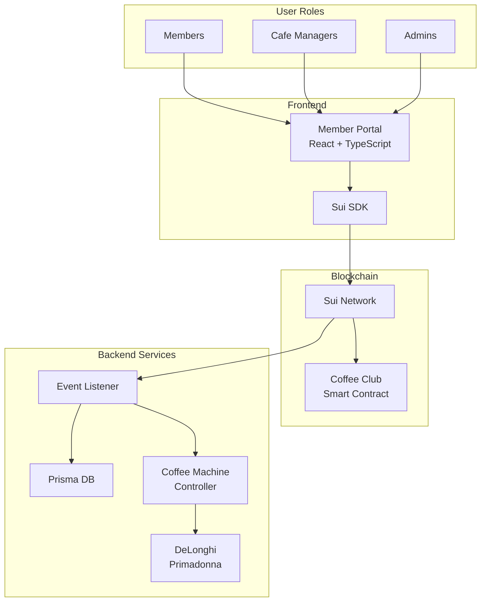

# Coffee Club System

The Coffee Club System is a decentralized coffee ordering platform built on the Sui blockchain, enabling members to order coffee from partner cafes using a smart contract system and automated coffee machine integration.

## System Overview

The Coffee Club system consists of four main components:

1. **Smart Contract (Move)**: Handles membership, cafe management, and order processing on the Sui blockchain
2. **Member Portal (React)**: Web interface for members to place orders and managers to oversee operations
3. **Event Listener**: Backend service that monitors blockchain events and triggers coffee machine actions
4. **Coffee Machine Controller**: Python-based Bluetooth controller for DeLonghi Primadonna machines

## Architecture Diagram

## Components

### Smart Contract (`coffee_club.move`)
- Manages membership NFTs
- Handles cafe registration and management
- Processes coffee orders with status tracking
- Implements role-based access control (Admin, Manager, Member)
- Emits events for order status changes

### Member Portal (`App.tsx`)
- React-based web interface
- Connects to Sui wallet
- Supports member registration
- Enables coffee ordering
- Provides cafe management interface
- Shows order history and status
- Role-based UI components

### Event Listener (`order-handler.ts`)
- Monitors Sui blockchain events
- Maintains order database using Prisma
- Triggers coffee machine actions
- Handles order status updates
- Manages error recovery

### Coffee Machine Controller (`delonghi_controller.py`)
- Bluetooth LE communication with DeLonghi machines
- Supports various coffee preparations
- Handles machine status monitoring
- Implements error handling and recovery
- Command-line interface for testing

## Features

- **Decentralized Membership**: NFT-based membership system
- **Role-Based Access**: Admin, Cafe Manager, and Member roles
- **Real-time Updates**: Order status tracking and notifications
- **Automated Brewing**: Direct coffee machine integration
- **Multi-Cafe Support**: Manages multiple cafe locations
- **Order History**: Tracks all orders and their statuses

## Technical Stack

- **Blockchain**: Sui Network
- **Smart Contract**: Move 
- **Frontend**: React, TypeScript, Sui SDK
- **Backend**: NestJS, Prisma
- **Machine Control**: Python, Bleak (Bluetooth LE)
- **Database**: PostgreSQL (via Prisma)
