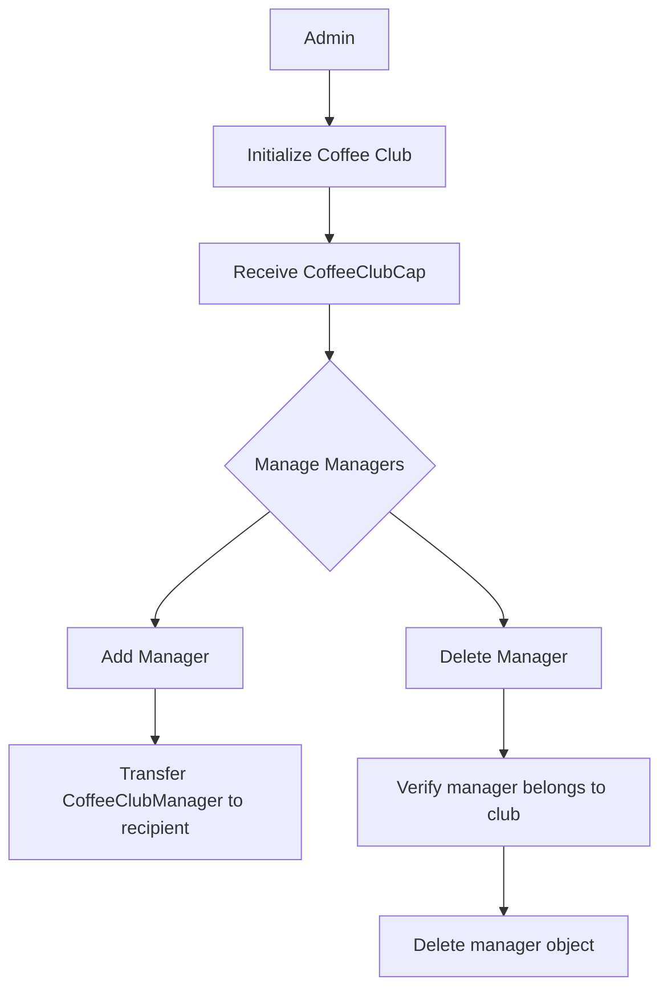
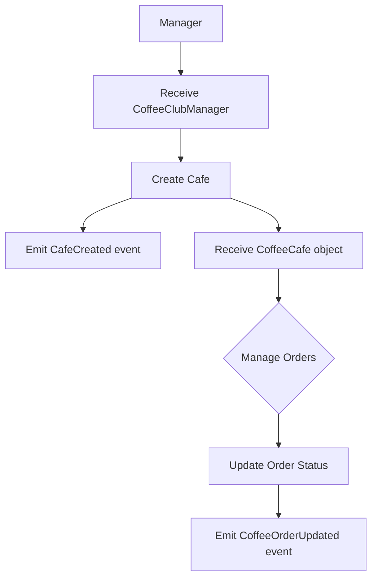
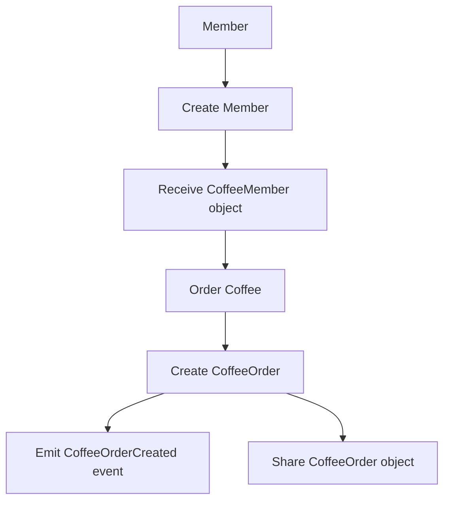

# Coffee Club

A decentralized coffee ordering and management system built on Move.

## Overview

Coffee Club is a blockchain-based platform that facilitates coffee ordering and management between cafes, managers, and members. The system uses capability-based security to manage permissions and roles.

## Key Components

- **Coffee Club**: The central entity that manages cafes and members
- **Managers**: Users with permissions to create and manage cafes
- **Cafes**: Coffee shops that can receive and fulfill orders
- **Members**: Users who can place coffee orders
- **Orders**: Coffee orders with status tracking

## Admin Flow



## Manager Flow


## Member Flow


```
10091  sui move build
10092  sui move test
10093  sui client publish

```

## Test Commands

### Initialize Coffee Club with Manager
```
export PACKAGE_ID=0x5d9f44c7f60391ceff82a5d6ef0c5a80dfaca76ab18ec100f871a0f754b56a30
export COFFEE_CLUB_CAP=0xf4cc64a5c5f50c8f6ae3e4f5c1c2bf56b0a4a7f0979b9b970a81fc8422c902fa
export RECIPIENT=0xe0db5a0d77625c28371d1339270db1ea1867b0b6e0655cf24bb7f2c9e2b2c40e
```

```
sui client call --package $PACKAGE_ID --module coffee_club --function add_manager --args $COFFEE_CLUB_CAP $RECIPIENT --gas-budget 10000000
```

### Create Cafe

```
export MANAGER_CAP=0xf4165838961cf783e90bacd6b2bbbcef1845d7f17260e5f163c916f3371391df
export CAFE_NAME=capy_cafe
```

```
sui client call --package $PACKAGE_ID --module coffee_club --function create_cafe --args $MANAGER_CAP $CAFE_NAME "sui_land" "sui cyber coffee" --gas-budget 10000000
```

### Create Member

```
export COFFEE_CLUB_ID=0xebeb7ce7a28e416a895027d593044e0c706ca8bfe5431637f19a547f33d45cab
```

```
sui client call --package $PACKAGE_ID --module coffee_club --function create_member --args $COFFEE_CLUB_ID --gas-budget 10000000
```

### Order Coffee

```
export MEMBER_OBJECT=0xf658397cba5868aa3257fb4f2e33dd87330b9f9c704800fa1bc08ec65ce153e3
export CAFE_ID=0xebeb7ce7a28e416a895027d593044e0c706ca8bfe5431637f19a547f33d45cab
```

```
sui client call --package $PACKAGE_ID --module coffee_club --function order_coffee --args $MEMBER_OBJECT $CAFE_ID --gas-budget 10000000
```

### Update Coffee Order

```
export ORDER_OBJECT=0xeedaf539591828dedf231c6f40d0650fcb200dcb1f333aa531e819570139301b
```

```
sui client call --package $PACKAGE_ID --module coffee_club --function update_coffee_order --args $CAFE_OBJECT $ORDER_OBJECT 1 --gas-budget 10000000
```
